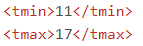
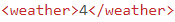

#Compte rendu TP2 et TP4 "POO API et outillages"
[Lien Github](https://github.com/OussamaBouazza/tp_api_meteo)

Une fois le programme lancé, saisir l'url suivant dans le navigateur :

	http://localhost:9090/search_address

#TP2 :

##Etape 5 - Description des dépendances :
- **Spring boot** : framework de développement JAVA permettant la création d'API web.
- **H2 database** : permet de gérer une base de donnée relationnelle en Java _in-memory_
- **Thymeleaf** : permet de créer des pages HTML avec Java

##Etape 13 :

1) **Avec quelle partie du code avons-nous paramétré l’url d’appel /greeting ?**
		
		@RequestParam(name="nameGET", required=false, defaultValue="World")
	
2) **Avec quelle partie du code avons-nous choisi le fichier HTML à afficher ?**
	
		return "greeting"
	
3) **Comment envoyons-nous le nom à qui nous disons bonjour avec le second lien ?**
	
   Dans l'URL, on saisi la donnée à envoyer pour le paramètre nameGET comme ceci :
   
		http://localhost:9090/greeting?nameGET=ENSIM
   

##Etape 17 :

**Relancez-votre application, retournez sur la console de H2 : http://localhost:8080/
h2-console. Avez-vous remarqu ́e une différence ? Ajoutez la réponse dans le README**
	
	La table ADRESS a été ajoutée avec les colonnes id, content et creation ainsi qu'une séquence Hibernate

##Etape 18 :
**Expliquez l’apparition de la nouvelle table en vous aidant de vos cours sur Hibernate, et
de la d´ependance Hibernate de Spring. Ajoutez la r´eponse dans le README.**

	L'ORM fait la correspondance entre l'objet et la base de donnée, crée les requêtes SQL, crée les base de données avec les annotations...

##Etape 20 :
	SELECT * FROM address

| ID    | Content           					| Creation  					|
| ----	|:-------------------------------------:|: ----------------------------:|
|1     	| 57 boulevard demorieux 				| 2021-11-02 18:08:32.988342 	|
|2     	| 51 allee du gamay, 34080 montpellier	| 2021-11-02 18:08:33.007209 	|

##Etape 23 :
	@Autowired gère les dépendances pour pouvoir trouver l'interface AddressRepository

##Etape 30 :
	<dependency>
		<groupId>org.webjars</groupId>
		<artifactId>bootstrap</artifactId>
		<version>5.1.3</version>
	</dependency>

#TP4 :

##Etape 6 :

- **Faut-il une cl´e API pour appeler MeteoConcept ?**

L'API  MeteoConcept n'est accessible qu'avec un jeton/token personnel. Sans ce jeton, l'API ne renvoit aucune donnée.

- **Quelle URL appeler ?**

  	https://api.meteo-concept.com/api/forecast/daily?token= + token +
  	&latlng= + latitude + , + longitude

Avec token  = notre jeton personnel.

- **Quelle m´ethode HTTP utiliser ?**

Il faut utiliser la méthode **GET** avec en paramètre les coordonnées géographique de l'endroit où l'on souhaite obtenir les prévisions météos

- **Comment passer les paramètres d’appels ?**

Comme vu précédemment, on saisit les coordonnées géographique après l'attribut **_latlng_**

- **Où est l’information dont j’ai besoin dans la réponse :**
	- Pour afficher la température du lieu visé par les coordonnées GPS :
	
		
	- Pour afficher la prévision de météo du lieu visé par les coordonnées GPS :
		